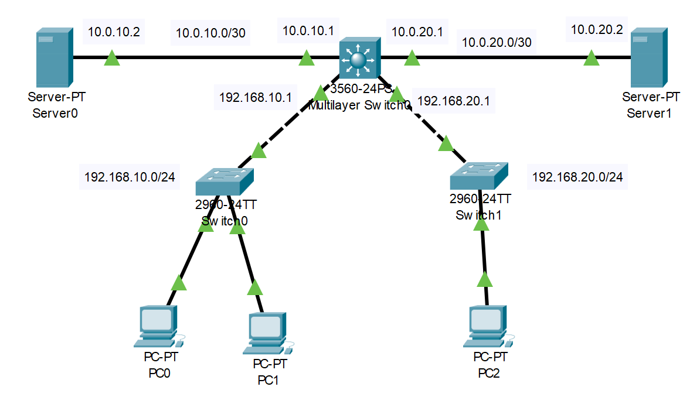
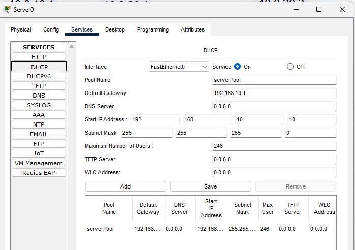
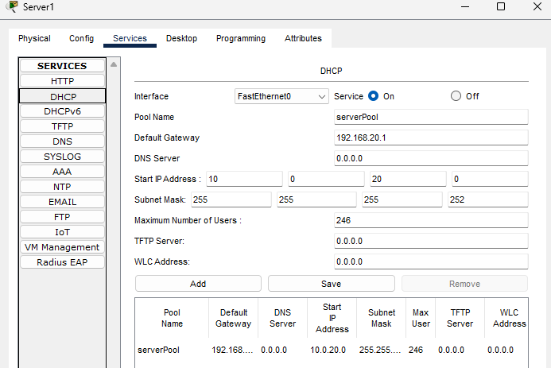

## Cofiguracion DHCP en Router

#### ID RED
192.168.10.0/24
#### Default gateway
192.168.10.1
```shell
    # Router
    interface Gig0/0
    ip address 192.168.10.1 255.255.255.0
    no shutdown
    # Excusion de IP
    ip dhcp excluded-address 192.168.10.1
    # Definicion del POOL
    ip dhcp pool REDES2
    # Definicion Rango de IP'S
    network 192.168.10.0 255.255.255.0
    # Default gateway
    default-router 192.168.10.1
```

## Configuracion DHCP Server

### Topologia


### Servidores DHCP





### Comandos
```shell
    ip routing
    # Interfaz vlan 10
    interface fa0/1
    no switchport
    ip address 192.168.10.1 255.255.255.0
    exit
    # Interfaz vlan 20
    interface fa0/2
    no switchport
    ip address 192.168.20.1 255.255.255.0
    exit
    # Red DHCP 1
    interface fa0/3
    no switchport
    ip address 10.0.10.1 255.255.255.252
    exit
    # Red DHCP 2
    interface fa0/4
    no switchport
    ip address 10.0.20.1 255.255.255.252
    exit
    # Helper Address
    interface fa0/1
    ip helper-address 10.0.10.1
    exit
    interface fa0/2
    ip helper-address 10.0.20.1
    exit
```