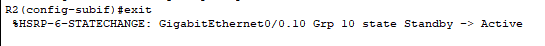
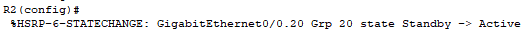

# HSRP

## Comandos importantes

```shell
standby [grupo] priority [valor]
```

`[grupo]`: Es el número del grupo HSRP al que pertenece la interfaz. Puede ser cualquier valor entre 0 y 255. Algunos dispositivos reservan el 0 y el 255.

`[valor]`: El valor de la prioridad determina la preferencia de un router para convertirse en el router activo dentro del grupo HSRP. El valor de la prioridad puede estar en el rango de 0 a 255.

```shell
standby [grupo] preempt
```

`[grupo]`: Es el número del grupo HSRP al que pertenece la interfaz. Puede ser cualquier valor entre 0 y 255. Algunos dispositivos reservan el 0 y el 255.

`preempt`: Esta opcion nos asegura que cuando un router con mayor prioridad caiga y vuelva a recuperarse vuelva a ser el router activo.

```shell
show standby
```

Visualizar los grupos configurados e informacion importante sobre las configuraciones realizadas.

## Logs Status





# VLANs

|VLAN|ID RED|CIDR|Puerta de Enlace|
|-|-|-|-|
|10|192.168.10.0|/24|192.168.10.1|
|20|192.168.20.0|/24|192.168.20.1|

# IPs

|Equipo|Interfaz|IP|Mascara|
|-|-|-|-|
|PC0|fa0|192.168.10.10|255.255.255.0|
|PC1|fa0|192.168.20.10|255.255.255.0|
|R1|G0/0.10|192.168.20.2|255.255.255.0|
|R1|G0/0.20|192.168.20.2|255.255.255.0|
|R1|G0/1|10.0.50.1|255.255.255.252|
|R1|Virtual|192.168.20.1|255.255.255.0|
|R2|G0/0.10|192.168.20.3|255.255.255.0|
|R2|G0/0.20|192.168.20.3|255.255.255.0|
|R2|G0/1|10.0.60.1|255.255.255.252|
|R2|Virtual|192.168.20.1|255.255.255.0|
|MSW0|fa0/1|10.0.50.2|255.255.255.252|
|MSW0|fa0/2|10.0.60.2|255.255.255.252|

# Comandos

## SW0
```shell
enable
configure terminal
hostname SW0
vlan 10
name NARANJA
vlan 20
name ROSADO
exit
interface fa0/1
switchport access vlan 10
exit
interface fa0/2
switchport mode access
switchport access vlan 20
exit
interface range fa0/3-24
switchport mode trunk
switchport trunk allowed vlan all
exit
do write
```

## R1
```shell
enable
configure terminal
hostname R1
interface gigabitEthernet 0/0
no shutdown
exit
interface gigabitEthernet 0/1
no shutdown
ip address 10.0.50.1 255.255.255.252
exit
interface gigabitEthernet 0/0.10
encapsulation dot1Q 10
ip address 192.168.10.2 255.255.255.0
no shutdown
exit
interface gigabitEthernet 0/0.20
encapsulation dot1Q 20
ip address 192.168.20.2 255.255.255.0
no shutdown
exit
interface gigabitEthernet 0/0.10
standby 10 ip 192.168.10.1
standby 10 priority 100
standby 10 preempt
exit
interface gigabitEthernet 0/0.20
standby 20 ip 192.168.20.1
standby 20 priority 100
standby 20 preempt
exit
router eigrp 1
network 192.168.10.0 0.0.0.255
network 192.168.20.0 0.0.0.255
network 10.0.50.0 0.0.0.3
no auto-summary
exit
do write
```

## R2
```shell
enable
configure terminal
hostname R2
interface gigabitEthernet 0/0
no shutdown
exit
interface gigabitEthernet 0/1
no shutdown
ip address 10.0.60.1 255.255.255.252
exit
interface gigabitEthernet 0/0.10
encapsulation dot1Q 10
ip address 192.168.10.3 255.255.255.0
no shutdown
exit
interface gigabitEthernet 0/0.20
encapsulation dot1Q 20
ip address 192.168.20.3 255.255.255.0
no shutdown
exit
interface gigabitEthernet 0/0.10
standby 10 ip 192.168.10.1
standby 10 priority 110
standby 10 preempt
exit
interface gigabitEthernet 0/0.20
standby 20 ip 192.168.20.1
standby 20 priority 110
standby 20 preempt
exit
router eigrp 1
network 192.168.10.0 0.0.0.255
network 192.168.20.0 0.0.0.255
network 10.0.60.0 0.0.0.3
no auto-summary
exit
do write
```

## MSW1
```shell
enable
configure terminal
hostname MSW0
ip routing
interface fa 0/1
no switchport
ip address 10.0.50.2 255.255.255.252
no shutdown
exit
interface fa 0/2
no switchport
ip address 10.0.60.2 255.255.255.252
no shutdown
exit
router eigrp 1
network 10.0.50.0 0.0.0.3
network 10.0.60.0 0.0.0.3
no auto-summary
exit
do write
```